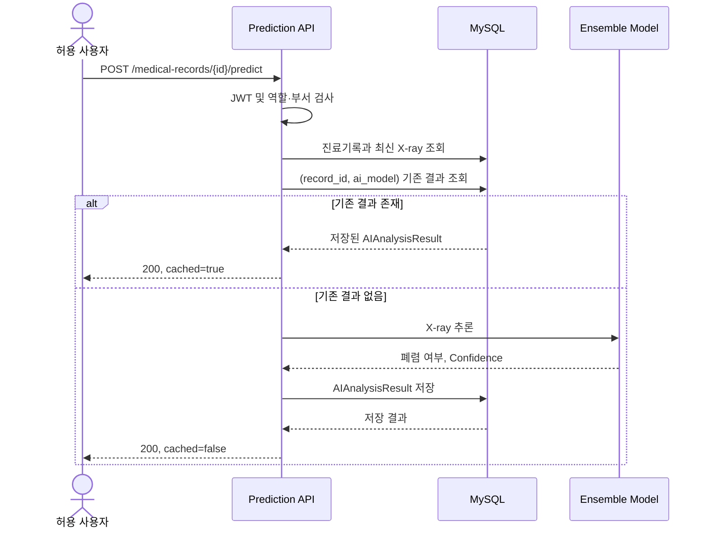

# 6일차 폐렴 예측 API 설계서

## 1. 문서 개요

본 문서는 진료기록에 등록된 X-ray 이미지로 폐렴 여부를 예측하고,
결과를 저장·조회하는 API 계약과 모델 성능 평가 기준을 정의한다.

| 항목 | 내용 |
| --- | --- |
| 기능 요구사항 | `REQ-PRED-001` AI 모델 활용 폐렴 예측 |
| 비기능 요구사항 | `NFR-PRED` AI 모델 평가 기준 |
| API 버전 | v1 |
| Base URL | `/v1/` |
| 인증 방식 | JWT Bearer Token |
| 요청/응답 형식 | `application/json` |
| 허용 사용자 | 활성 `STAFF` 중 `MEDICAL`, `DEV`, `RESEARCH` 부서 및 `ADMIN` |
| 예측 모델 | `strict_focal_clahe_letterbox_384_5fold` |
| 판정 임계값 | 폐렴 확률 `0.36` 이상 |

---

## 2. 요구사항 해석

### 2.1 기능 요구사항

`REQ-PRED-001`은 다음 동작을 요구한다.

1. 사용자가 진료기록 상세 페이지에서 `AI 예측 결과보기` 버튼을 누른다.
2. 진료기록 등록 시 업로드한 X-ray를 예측 입력으로 사용한다.
3. 동일한 진료기록과 동일한 모델의 저장 결과가 있으면 재추론하지 않는다.
4. 결과가 없을 때만 AI 추론을 수행하고 DB에 저장한다.
5. AI 예측 결과 영역에서 폐렴 여부, Confidence 및 선택적 Heatmap을 확인한다.

### 2.2 비기능 요구사항

`NFR-PRED`은 API 기능이 아니라 정답 라벨이 있는 평가 데이터셋을 이용한
모델 품질 검증 기준이다.

| 지표 | 최소 통과 기준 | 목표 기준 | 계산식 |
| --- | ---: | ---: | --- |
| Recall(민감도) | `0.90` 이상 | `0.95` 이상 | `TP / (TP + FN)` |
| Accuracy(정확도) | `0.80` 이상 | `0.90` 이상 | `(TP + TN) / (TP + TN + FP + FN)` |

요구사항의 `N: 정상인임을 진단`은 혼동행렬 표준 명칭에 따라 `TN`으로 해석한다.

---

## 3. 프로젝트 현황과 설계 결정

### 3.1 현재 구성

| 구성 요소 | 현재 상태 |
| --- | --- |
| 프론트엔드 예측 호출 | `POST /api/v1/medical-records/{record_id}/predict` 코드 존재 |
| 프론트엔드 결과 조회 | `GET /api/v1/medical-records/{record_id}/analyses` 코드 존재 |
| 예측 라우터 | `app/apis/prediction_apis.py`에 엔드포인트 미구현 |
| 모델 추론 | `worker/model.py`의 `predict()` 구현 완료 |
| 모델 파일 | 3개 백본 × 5-fold, 총 15개 체크포인트 |
| 분석 결과 모델 | `AIAnalysisResult` 정의됨 |
| Heatmap | 미구현, 요구사항상 선택사항 |
| API Timeout | `TimeoutRoute`가 모든 요청을 3초로 제한 |

### 3.2 공개 API 계약

프론트엔드의 `API_BASE = "/api/v1"`와 기존 호출 코드를 유지한다.

| Method | Endpoint | 기능 |
| --- | --- | --- |
| `POST` | `/v1/medical-records/{record_id}/predict` | 기존 결과 반환 또는 신규 예측 |
| `GET` | `/v1/medical-records/{record_id}/analyses` | 저장된 예측 결과 목록 조회 |
| `GET` | `/v1/ai-analyses/{analysis_id}/heatmap` | Heatmap 조회(선택 기능) |

현재 라우터의 `/prediction_api` prefix는 공개 계약과 다르므로 구현 시 조정한다.

### 3.3 Confidence 정의

`confidence`는 최종 판정 클래스에 대한 확신도를 `0.00~100.00` 백분율로 반환한다.

```text
폐렴 판정: confidence = pneumonia_probability × 100
정상 판정: confidence = (1 - pneumonia_probability) × 100
```

예를 들어 폐렴 확률이 `0.20`이면 정상으로 판정하고 Confidence는 `80.00`이다.
DB의 `Numeric(5, 2)`와 프론트엔드의 `%` 표시에 맞춰 백분율로 저장한다.

### 3.4 기존 결과 재사용 기준

요구사항에 따라 캐시 키는 다음 조합이다.

```text
(record_id, ai_model)
```

동시 요청으로 중복 행이 생기지 않도록 DB에 다음 제약을 추가한다.

```text
UNIQUE(record_id, ai_model)
```

진료기록의 X-ray가 교체되면 기존 결과가 유효하지 않으므로 이미지 변경
트랜잭션에서 해당 `record_id`의 기존 AI 결과와 Heatmap을 삭제한다.

---

## 4. 공통 정책

### 4.1 인증 헤더

```http
Authorization: Bearer <access_token>
```

### 4.2 권한

- `STAFF` + `MEDICAL`
- `STAFF` + `DEV`
- `STAFF` + `RESEARCH`
- `ADMIN` (기존 정책에 따라 부서와 무관하게 허용)

구현 시 역할과 부서를 모두 검사한다.

```python
require_permissions(
    allowed_roles=(RoleEnum.STAFF,),
    allowed_departments=(
        DepartmentEnum.MEDICAL,
        DepartmentEnum.DEV,
        DepartmentEnum.RESEARCH,
    ),
)
```

부서만 검사하면 `PENDING` 사용자도 통과할 수 있으므로 `allowed_roles`를 생략하지 않는다.

### 4.3 오류 응답

```json
{
  "detail": "사용자에게 안내할 한국어 오류 메시지"
}
```

실패 응답의 `detail`은 내부 오류 코드나 영문 예외를 그대로 노출하지 않고
사용자가 이해할 수 있는 한국어 문장으로 반환한다. 상세 예외와 추적 정보는
서버 로그에만 기록한다.

| 상태 코드 | 의미 |
| --- | --- |
| `401 Unauthorized` | 토큰 누락, 만료, 변조 또는 활성 사용자 없음 |
| `403 Forbidden` | 역할 또는 부서가 허용되지 않음 |
| `404 Not Found` | 진료기록, 분석 결과 또는 Heatmap 없음 |
| `409 Conflict` | 진료기록은 있지만 예측할 X-ray가 없음 |
| `422 Unprocessable Entity` | 경로 파라미터 검증 실패 |
| `500 Internal Server Error` | DB 또는 파일 처리 실패 |
| `503 Service Unavailable` | 모델을 로드할 수 없거나 준비되지 않음 |
| `504 Gateway Timeout` | 예측 제한 시간 초과 |

### 4.4 시간 제한과 실행 방식

15개 모델의 CPU 추론은 현재 3초 제한을 초과할 수 있으므로 예측 API에 일반
조회 API와 같은 제한을 적용하면 안 된다.

- 기존 결과 조회: 목표 3초 이내
- 신규 추론: 운영 환경 측정 후 별도 제한 적용(초기 권장값 60초)
- CPU 추론은 이벤트 루프를 막지 않도록 `asyncio.to_thread()`에서 실행
- 요청량이 늘면 별도 작업 큐와 추론 worker로 분리
- 모델은 요청마다 로드하지 않고 프로세스 시작 시 한 번만 메모리에 로드

---

## 5. AI 폐렴 예측 실행 API

### 5.1 API 개요

| 항목 | 내용 |
| --- | --- |
| API 이름 | 진료기록 X-ray 폐렴 예측 |
| 요구사항 | `REQ-PRED-001` |
| Method | `POST` |
| Endpoint | `/v1/medical-records/{record_id}/predict` |
| 인증 | 필수 |
| Request Body | 없음 |
| 성공 상태 | `200 OK` |
| 재호출 정책 | 동일 `(record_id, ai_model)` 결과가 있으면 저장값 반환 |

신규 결과와 캐시 결과 모두 `200 OK`로 통일하고 `cached` 필드로 구분한다.

### 5.2 요청

#### Path Parameter

| 이름 | 타입 | 필수 | 제약 | 설명 |
| --- | --- | --- | --- | --- |
| `record_id` | integer(int64) | Y | 1 이상 | 예측할 진료기록 ID |

Request Body와 Query Parameter는 없다. 연결된 X-ray가 여러 장이면
`shooting_datetime DESC, id DESC` 기준의 최신 이미지를 사용한다.

```bash
curl -X POST \
  "http://localhost:8000/api/v1/medical-records/101/predict" \
  -H "Authorization: Bearer <access_token>"
```

### 5.3 성공 응답

#### 신규 결과 `200 OK`

```json
{
  "id": 501,
  "record_id": 101,
  "is_pneumonia": true,
  "confidence": 96.55,
  "heatmap_url": null,
  "ai_model": "strict_focal_clahe_letterbox_384_5fold",
  "cached": false,
  "created_at": "2026-07-21T16:30:15"
}
```

#### 기존 저장 결과 `200 OK`

```json
{
  "id": 501,
  "record_id": 101,
  "is_pneumonia": true,
  "confidence": 96.55,
  "heatmap_url": null,
  "ai_model": "strict_focal_clahe_letterbox_384_5fold",
  "cached": true,
  "created_at": "2026-07-21T16:30:15"
}
```

| 필드 | 타입 | Nullable | 설명 |
| --- | --- | --- | --- |
| `id` | integer(int64) | N | AI 분석 결과 ID |
| `record_id` | integer(int64) | N | 진료기록 ID |
| `is_pneumonia` | boolean | N | 폐렴 판정 여부 |
| `confidence` | number(decimal) | N | 최종 클래스 신뢰도 `0.00~100.00` |
| `heatmap_url` | string | Y | Grad-CAM 등 병변 표시 이미지 URL |
| `ai_model` | string | N | 모델과 전처리 버전 식별자 |
| `cached` | boolean | N | 기존 저장 결과 재사용 여부 |
| `created_at` | string(datetime) | N | 최초 분석 일시 |

### 5.4 실패 응답

#### `401 Unauthorized`

토큰이 없거나 유효하지 않은 경우이다.

```json
{
  "detail": "인증 정보가 유효하지 않습니다. 다시 로그인해주세요."
}
```

토큰이 만료된 경우에는 다음 메시지를 반환한다.

```json
{
  "detail": "로그인 정보가 만료되었습니다. 다시 로그인해주세요."
}
```

#### `403 Forbidden`

```json
{
  "detail": "AI 예측 결과를 확인할 권한이 없습니다."
}
```

#### `404 Not Found`

```json
{
  "detail": "해당 진료기록을 찾을 수 없습니다."
}
```

#### `409 Conflict`

```json
{
  "detail": "예측에 사용할 X-ray 이미지가 없습니다."
}
```

#### `422 Unprocessable Entity`

```json
{
  "detail": "진료기록 ID는 1 이상의 정수여야 합니다."
}
```

#### `500 Internal Server Error`

```json
{
  "detail": "AI 예측 결과를 처리하는 중 오류가 발생했습니다."
}
```

#### `503 Service Unavailable`

```json
{
  "detail": "AI 예측 모델을 사용할 수 없습니다. 잠시 후 다시 시도해주세요."
}
```

#### `504 Gateway Timeout`

```json
{
  "detail": "AI 예측 처리 시간이 초과되었습니다. 잠시 후 다시 시도해주세요."
}
```

내부 예외나 로컬 파일 경로는 응답에 노출하지 않고 서버 로그에만 기록한다.

### 5.5 처리 절차



1. JWT, 활성 상태, 역할 및 부서를 확인한다.
2. 진료기록이 없으면 `404`를 반환한다.
3. 최신 X-ray 메타데이터와 파일이 없으면 `409`를 반환한다.
4. `(record_id, ai_model)`의 기존 결과가 있으면 `cached=true`로 반환한다.
5. 결과가 없으면 X-ray 경로를 검증하고 `worker.model.predict()`를 실행한다.
6. 선택적으로 Heatmap을 생성한다.
7. 분석 결과를 DB 트랜잭션으로 저장한다.
8. Unique Constraint 충돌 시 rollback 후 먼저 저장된 결과를 조회한다.
9. 신규 결과를 `cached=false`로 반환한다.

### 5.6 모델 결과와 DB 매핑

| 모델 결과 | DB 컬럼 | 처리 |
| --- | --- | --- |
| `prediction` | 없음 | `is_pneumonia`로 표현하므로 미저장 |
| `is_pneumonia` | `is_pneumonia` | 저장 |
| `confidence` | `confidence` | 저장 |
| `pneumonia_probability` | 없음 | 현재 요구사항에서는 미저장 |
| `threshold` | 없음 | 모델 설정으로 관리 |
| `ai_model` | `ai_model` | 저장 |
| Grad-CAM 결과 | `heatmap_url` | 구현 시 저장, 아니면 `NULL` |

### 5.7 트랜잭션과 파일 정책

- 모델 추론 실패 시 DB 행을 만들지 않는다.
- Heatmap은 선택사항이므로 생성만 실패하면 예측값은 저장할 수 있다.
- Heatmap 저장 후 DB 커밋이 실패하면 생성 파일을 삭제한다.
- 파일명은 UUID 기반으로 만들고 사용자 입력을 사용하지 않는다.
- 저장 경로가 프로젝트 `media` 디렉터리 내부인지 검증한다.
- 로그에는 `record_id`, `ai_model`, 처리 시간, 캐시 여부를 기록한다.
- 환자 이미지와 예측값 자체를 일반 로그에 기록하지 않는다.

### 5.8 인수 조건

- 최초 요청은 결과 한 건을 저장하고 `cached=false`를 반환한다.
- 동일 진료기록과 모델의 재요청은 행을 추가하지 않고 `cached=true`를 반환한다.
- X-ray가 없으면 모델을 실행하지 않고 `409`를 반환한다.
- 권한이 없으면 모델과 DB를 호출하지 않고 `403`을 반환한다.
- Confidence는 소수점 둘째 자리 백분율이다.
- Heatmap 미구현 또는 생성 실패 시 `heatmap_url`은 `null`이다.

---

## 6. 저장된 예측 결과 목록 조회 API

### 6.1 API 개요

| 항목 | 내용 |
| --- | --- |
| API 이름 | 진료기록 AI 예측 결과 목록 조회 |
| Method | `GET` |
| Endpoint | `/api/v1/medical-records/{record_id}/analyses` |
| 인증 | 필수 |
| 성공 상태 | `200 OK` |
| 정렬 | `created_at DESC, id DESC` |

### 6.2 요청

| 이름 | 위치 | 타입 | 필수 | 제약 | 설명 |
| --- | --- | --- | --- | --- | --- |
| `record_id` | Path | integer(int64) | Y | 1 이상 | 조회할 진료기록 ID |

```bash
curl \
  "http://localhost:8000/api/v1/medical-records/101/analyses" \
  -H "Authorization: Bearer <access_token>"
```

### 6.3 성공 응답

```json
[
  {
    "id": 501,
    "record_id": 101,
    "is_pneumonia": true,
    "confidence": 96.55,
    "heatmap_url": null,
    "ai_model": "strict_focal_clahe_letterbox_384_5fold",
    "created_at": "2026-07-21T16:30:15"
  }
]
```

저장 결과가 없으면 `200 OK`와 빈 배열을 반환한다.

```json
[]
```

진료기록 자체가 없으면 빈 배열이 아니라 `404`를 반환한다.

### 6.4 실패 응답

| 상태 코드 | detail | 조건 |
| --- | --- | --- |
| `401` | `인증 정보가 유효하지 않습니다. 다시 로그인해주세요.` | 인증 실패 |
| `401` | `로그인 정보가 만료되었습니다. 다시 로그인해주세요.` | 토큰 만료 |
| `403` | `AI 예측 결과를 확인할 권한이 없습니다.` | 역할 또는 부서 불일치 |
| `404` | `해당 진료기록을 찾을 수 없습니다.` | 진료기록 없음 |
| `422` | `진료기록 ID는 1 이상의 정수여야 합니다.` | 잘못된 `record_id` |
| `500` | `AI 예측 결과를 조회하는 중 오류가 발생했습니다.` | DB 조회 실패 |

### 6.5 인수 조건

- 결과를 최신순으로 반환한다.
- 결과가 없으면 `200`과 `[]`를 반환한다.
- 존재하지 않는 진료기록은 `404`를 반환한다.
- 조회 API는 새로운 모델 추론을 수행하지 않는다.

---

## 7. Heatmap 이미지 조회 API(선택 기능)

| 항목 | 내용 |
| --- | --- |
| Method | `GET` |
| Endpoint | `/api/v1/ai-analyses/{analysis_id}/heatmap` |
| 인증 | 필수 |
| 성공 상태 | `200 OK` |
| 응답 형식 | `image/png` 또는 `image/jpeg` |

`heatmap_url`에는 공개 `/media` 경로 대신 위 인증 API 경로를 저장하거나 응답 시
조합하는 것을 권장한다. X-ray와 Heatmap은 의료 데이터이므로 인증 없이 공개되는
정적 파일 URL로 직접 제공하지 않는다.

| 상태 코드 | detail | 조건 |
| --- | --- | --- |
| `401` | `인증 정보가 유효하지 않습니다. 다시 로그인해주세요.` | 인증 실패 |
| `403` | `히트맵 이미지를 확인할 권한이 없습니다.` | 권한 없음 |
| `404` | `히트맵 이미지를 찾을 수 없습니다.` | 분석 결과, Heatmap 값 또는 파일이 없음 |

---

## 8. 요청·응답 및 DB 스키마

### 8.1 Pydantic 응답 스키마 제안

```python
from datetime import datetime
from decimal import Decimal

from pydantic import BaseModel, ConfigDict, Field


class AIAnalysisData(BaseModel):
    id: int
    record_id: int
    is_pneumonia: bool
    confidence: Decimal = Field(ge=0, le=100, decimal_places=2)
    heatmap_url: str | None = None
    ai_model: str
    created_at: datetime

    model_config = ConfigDict(from_attributes=True)


class AIPredictionResponse(AIAnalysisData):
    cached: bool
```

목록 조회는 `list[AIAnalysisData]`, 예측 실행은 `AIPredictionResponse`를 사용한다.

### 8.2 DB 변경 제안

```python
__table_args__ = (
    UniqueConstraint("record_id", "ai_model", name="uq_ai_analysis_record_model"),
    {"comment": "AI 분석 결과 저장 테이블"},
)

heatmap_url: Mapped[str | None] = mapped_column(
    String(255),
    nullable=True,
    comment="AI가 판별한 병변 표시 이미지 URL",
)
```

Alembic migration 작업:

1. `heatmap_url`을 nullable로 변경한다.
2. `(record_id, ai_model)` Unique Constraint를 추가한다.
3. 기존 중복 데이터가 있다면 제약 추가 전에 정리한다.
4. 모델과 실제 DB의 `record_id` 외래키 상태를 확인한다.

---

## 9. 모델 성능 평가 계획

### 9.1 평가 API를 만들지 않는 이유

Recall과 Accuracy에는 실제 정답 라벨이 필요하다. 운영 중 사용자가 올린 X-ray에는
검증된 정답이 없으므로 예측 API 응답만으로 성능을 계산할 수 없다.

따라서 `NFR-PRED`는 공개 API가 아닌 `worker/evaluate.py` 형태의 오프라인 평가
스크립트와 평가 보고서로 검증한다.

### 9.2 평가 정책

- 학습 데이터와 분리된 정답 라벨 포함 데이터 사용
- 독립 테스트가 없다면 5-fold OOF 결과임을 명시
- 운영 코드와 동일한 CLAHE, letterbox, ImageNet 정규화 사용
- 동일한 15개 체크포인트, 백본 가중치, threshold `0.36` 사용
- 평가 중 threshold를 다시 조정하지 않음
- 환자 X-ray 원본은 Git 저장소에 커밋하지 않음

### 9.3 혼동행렬 정의

| 실제 / 예측 | 정상 예측 | 폐렴 예측 |
| --- | ---: | ---: |
| 실제 정상 | TN | FP |
| 실제 폐렴 | FN | TP |

- TP: 폐렴 환자를 폐렴으로 예측
- TN: 정상인을 정상으로 예측
- FP: 정상인을 폐렴으로 예측
- FN: 폐렴 환자를 정상으로 예측하며 가장 위험한 오류

### 9.4 통과 기준

```text
Recall = TP / (TP + FN) >= 0.90
Accuracy = (TP + TN) / (TP + TN + FP + FN) >= 0.80
```

Recall이 최소 기준을 충족하지 못하면 Accuracy와 관계없이 실패로 판정한다.

### 9.5 현재 OOF 기준선

`best_oof_ensemble_config.json`의 혼동행렬을 `[[TN, FP], [FN, TP]]`로
해석하면 다음과 같다.

| 값 | 수량 |
| --- | ---: |
| TN | 1,322 |
| FP | 19 |
| FN | 17 |
| TP | 3,858 |
| 전체 | 5,216 |

```text
Recall   = 3,858 / (3,858 + 17) = 0.9956
Accuracy = (1,322 + 3,858) / 5,216 = 0.9931
```

| 지표 | 결과 | 최소 기준 | 판정 |
| --- | ---: | ---: | --- |
| Recall | 0.9956 | 0.90 | PASS |
| Accuracy | 0.9931 | 0.80 | PASS |

이는 OOF 내부 검증 결과이며 독립 테스트 결과와 구분해 보고한다.

### 9.6 평가 산출물

`reports/model_evaluation.md` 또는 JSON/CSV에 다음 정보를 남긴다.

- 평가 환경과 일시
- 모델명, 체크포인트 식별 정보, threshold, 백본 가중치
- 전체 표본 수와 클래스 분포
- TP, TN, FP, FN 및 Confusion Matrix
- Recall, Accuracy와 통과 여부
- False Negative 사례의 비식별 식별자
- 오분류 분석과 알려진 한계

---

## 10. 테스트 설계

### 10.1 예측 API

| 테스트 | 기대 결과 |
| --- | --- |
| 허용 사용자 + 유효 기록 + X-ray | `200`, 결과 저장, `cached=false` |
| 같은 기록과 모델 재요청 | `200`, 행 증가 없음, `cached=true` |
| 동일 요청 동시 실행 | 결과 한 건만 유지 |
| 진료기록 없음 | `404` |
| X-ray 없음 | `409` |
| `PENDING` 사용자 | `403` |
| 모델 로드 실패 | `503`, DB 변경 없음 |
| 추론 제한 시간 초과 | `504`, 불완전 결과 없음 |
| Heatmap 생성만 실패 | 예측 성공, `heatmap_url=null` |

### 10.2 조회 API

| 테스트 | 기대 결과 |
| --- | --- |
| 저장 결과 존재 | `200`, 최신순 목록 |
| 저장 결과 없음 | `200`, `[]` |
| 진료기록 없음 | `404` |
| 권한 없음 | `403` |
| 조회 요청 | 모델 추론 미호출 |

### 10.3 모델 평가

| 테스트 | 기대 결과 |
| --- | --- |
| Recall `0.90` | PASS |
| Recall `0.90` 미만 | FAIL |
| Accuracy `0.80` | PASS |
| Accuracy `0.80` 미만 | FAIL |
| 지표 분모가 0 | 명시적 평가 오류 |

---

## 11. 구현 전 확인사항

1. `prediction_apis.py` 경로를 `/v1` 계약에 맞춘다.
2. `app/schemas/prediction.py`에 Pydantic 응답 스키마를 작성한다.
3. `heatmap_url` nullable migration을 만든다.
4. `(record_id, ai_model)` Unique Constraint migration을 만든다.
5. 3초 `TimeoutRoute`를 신규 추론에 그대로 적용하지 않는다.
6. CPU 추론으로 FastAPI 이벤트 루프를 차단하지 않는다.
7. Docker 또는 별도 worker에 `worker/`, 모델 파일, PyTorch 의존성을 포함한다.
8. 배포 단계에서 Git LFS 모델 파일 다운로드 여부를 검증한다.
9. X-ray 교체 시 기존 분석 결과 무효화 정책을 구현한다.
10. Heatmap을 인증 없이 공개 정적 경로로 제공하지 않는다.

---

## 12. 완료 조건

- 두 공개 API가 문서의 요청·응답 계약을 따른다.
- 역할·부서 인증 테스트가 통과한다.
- 최초 예측과 기존 결과 재사용이 구분되어 동작한다.
- 동일 진료기록과 모델 결과가 중복 저장되지 않는다.
- Confidence 단위가 API, DB, 화면에서 백분율로 일치한다.
- Heatmap 없이도 예측 API가 정상 동작한다.
- Recall, Accuracy 및 Confusion Matrix가 문서화된다.
- Recall `0.90`, Accuracy `0.80`의 최소 기준을 충족한다.
