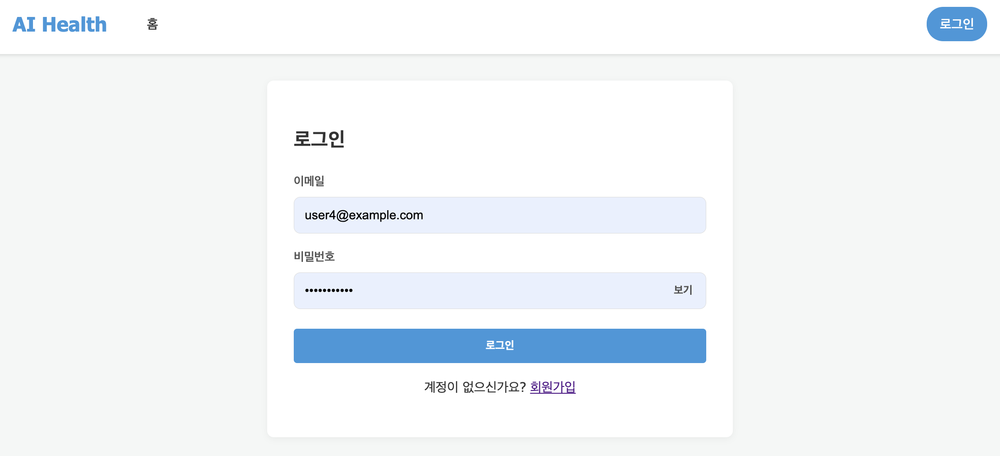
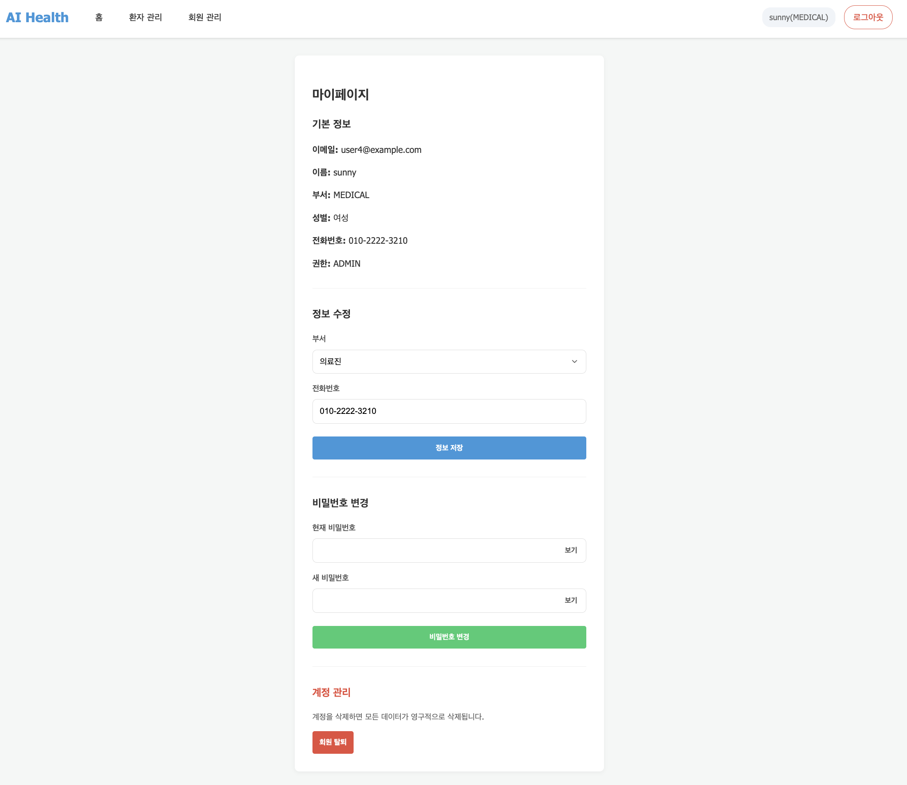
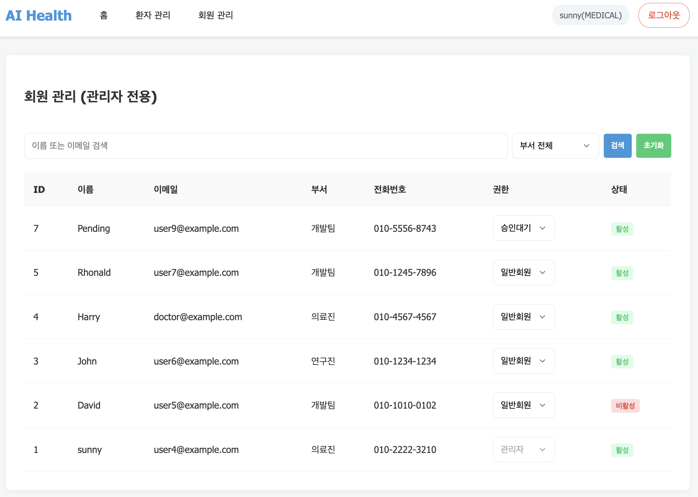
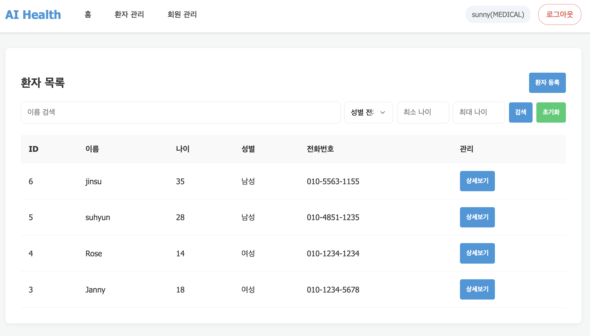
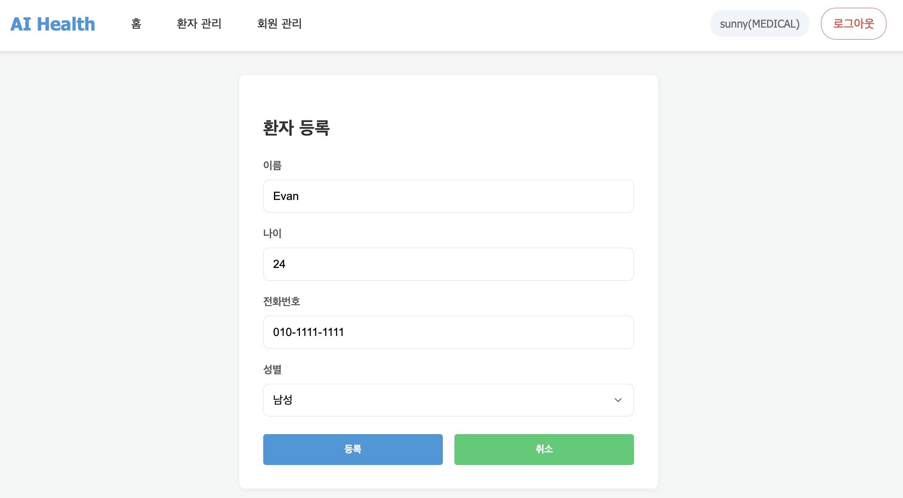
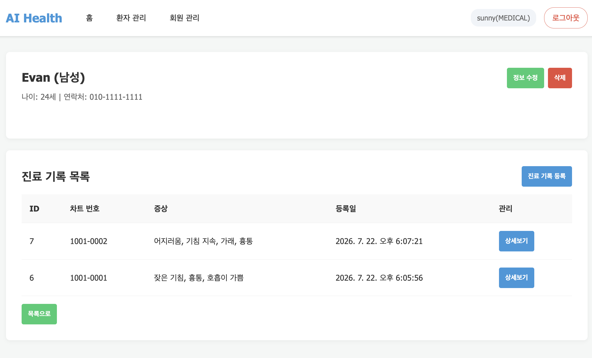
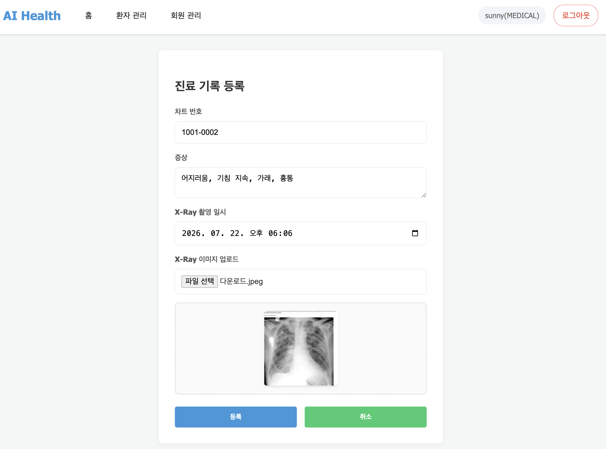
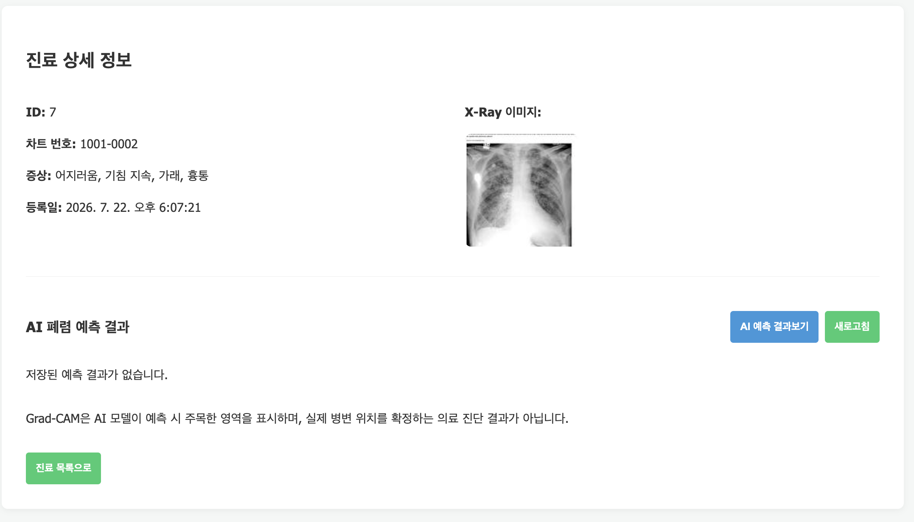
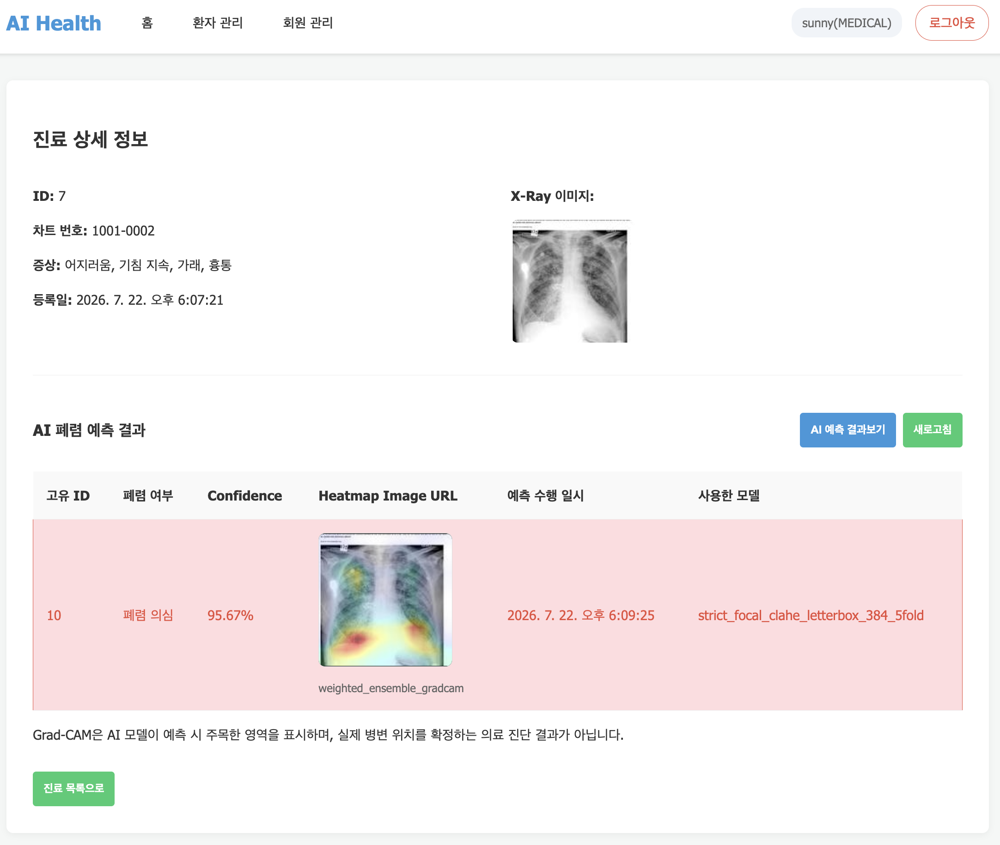

# 7일차 앱 실행 화면 및 API 연결 결과

## 1. 문서 개요

본 문서는 FastAPI 앱과 프론트엔드 템플릿의 API 연결 결과를 확인하고, 각 화면에서 호출되는 endpoint와 동작 결과를 정리한다.

- 앱 실행 주소: `http://127.0.0.1:8000/`
- Swagger 문서: `http://127.0.0.1:8000/docs`
- 인증 방식: JWT Bearer Token
- 프론트엔드 API 호출: `static/apis.js`
- 화면 렌더링: `static/pages.js`
- 화면 템플릿: `static/templates/`

---

## 2. 로그인

| 항목 | 내용 |
| --- | --- |
| Method | `POST` |
| Endpoint | `/auth_api/v1/auth/login/` |
| 동작 | 이메일과 비밀번호를 입력하여 로그인한다. |
| 성공 결과 | Access Token이 저장되고 사용자 권한에 맞는 화면으로 이동한다. |
| 실패 결과 | 이메일 또는 비밀번호 오류 메시지를 표시한다. |

---

## 3. 마이페이지

| 기능 | Method | Endpoint |
| --- | --- | --- |
| 내 정보 조회 | `GET` | `/mypage_api/v1/users/me` |
| 내 정보 수정 | `PATCH` | `/mypage_api/v1/users/me` |
| 비밀번호 변경 | `PATCH` | `/mypage_api/v1/users/me/password/` |
| 회원 탈퇴 | `DELETE` | `/mypage_api/v1/users/me` |

로그인한 사용자는 본인의 회원정보를 조회할 수 있다. `PENDING`, `STAFF`, `ADMIN` 회원 모두 마이페이지에 접근할 수 있으며, 부서와 전화번호 수정, 비밀번호 변경 및 회원 탈퇴 기능을 사용할 수 있다.

---

## 4. 회원관리

| 기능 | Method | Endpoint |
| --- | --- | --- |
| 회원 목록 조회 | `GET` | `/user_api/v1/users` |
| 회원 권한 변경 | `PATCH` | `/user_api/v1/users/{user_id}/role` |

관리자는 회원의 이름 또는 이메일을 검색하고 부서별로 목록을 조회할 수 있다. 회원의 권한을 승인대기, 일반회원 또는 관리자로 변경할 수 있다.

회원 목록의 부서 코드는 다음과 같이 한글 부서명으로 표시한다.

| API 코드 | 화면 표시 |
| --- | --- |
| `DEV` | 개발팀 |
| `MEDICAL` | 의료진 |
| `RESEARCH` | 연구진 |

---

## 5. 환자 목록 조회

| 항목 | 내용 |
| --- | --- |
| Method | `GET` |
| Endpoint | `/patient_api/v1/patients/` |
| 동작 | 등록된 환자 목록을 조회한다. |
| 검색 조건 | 이름, 성별, 최소 나이, 최대 나이 |
| 허용 사용자 | 활성화된 사내 사용자 및 관리자 |

---

## 6. 환자 등록

의료 부서 소속 사용자는 이름, 나이, 전화번호 및 성별을 입력하여 새로운 환자를 등록할 수 있다.

등록 버튼을 누르면 다음 API를 호출한다.

| 항목 | 내용 |
| --- | --- |
| Method | `POST` |
| Endpoint | `/patient_api/v1/patients/` |
| 입력 정보 | 이름, 나이, 전화번호, 성별 |
| 성공 시 | 환자를 등록하고 환자 목록 화면으로 이동 |
| 접근 권한 | 관리자 또는 의료 부서 소속 `STAFF` |

---

## 7. 환자 상세조회

| 기능 | Method | Endpoint |
| --- | --- | --- |
| 환자 상세조회 | `GET` | `/patient_api/v1/patients/{patient_id}` |
| 환자 정보 수정 | `PATCH` | `/patient_api/v1/patients/{patient_id}` |
| 환자 삭제 | `DELETE` | `/patient_api/v1/patients/{patient_id}` |
| 진료기록 목록 조회 | `GET` | `/record_api/v1/records` |

환자의 기본정보와 진료기록 목록을 표시한다. 각 진료기록의 상세보기 버튼을 통해 진료기록 상세 페이지로 이동할 수 있다.

---

## 8. 진료기록 등록

| 항목 | 내용 |
| --- | --- |
| Method | `POST` |
| Endpoint | `/record_api/v1/record/{patient_id}` |
| 요청 형식 | `multipart/form-data` |
| 입력 정보 | 차트 번호, 증상, 촬영일시, X-ray 이미지 |
| 허용 사용자 | 의료 부서 소속 사용자 |

X-ray 파일을 선택하면 업로드 전에 이미지 미리보기를 표시한다. 등록이 완료되면 환자 상세 페이지로 이동한다.

---

## 9. 진료기록 상세조회

| 기능 | Method | Endpoint |
| --- | --- | --- |
| 진료기록 상세조회 | `GET` | `/record_api/v1/records/{record_id}` |
| AI 예측 결과 조회 | `GET` | `/prediction_api/v1/medical-records/{record_id}/analyses` |

진료기록의 차트 번호, 증상, 등록일 및 X-ray 이미지를 표시한다. 로그인한 개발진, 의료 실무진, 연구진과 관리자가 상세정보를 조회할 수 있다.

AI 예측 결과 조회에 실패하더라도 기본 진료기록 상세정보는 정상적으로 표시한다.

---

## 10. AI 폐렴 예측

| 기능 | Method | Endpoint |
| --- | --- | --- |
| AI 폐렴 예측 실행 | `POST` | `/prediction_api/v1/medical-records/{record_id}/predict` |
| 저장된 결과 조회 | `GET` | `/prediction_api/v1/medical-records/{record_id}/analyses` |

진료기록에 등록된 X-ray 이미지를 이용하여 폐렴 여부를 예측한다. 결과 화면에는 폐렴 여부, Confidence, Heatmap, 예측 수행 일시 및 사용 모델을 표시한다.

저장된 결과가 없는 경우 빈 결과 안내를 표시하며, 예측 버튼을 누르면 AI 모델을 실행하고 결과를 저장한다.

---

## 11. 실행 결과

프론트엔드 템플릿과 FastAPI endpoint 연결을 완료하고 다음 기능의 정상 동작을 확인하였다.

- 회원가입 및 로그인V
- 마이페이지 조회와 회원정보 관리
- 관리자 회원 목록 및 권한 관리
- 환자 등록·목록·상세·수정·삭제
- 진료기록 등록·목록·상세조회
- X-ray 이미지 표시
- AI 폐렴 예측 및 결과 조회
- 역할과 부서에 따른 화면 접근 제한