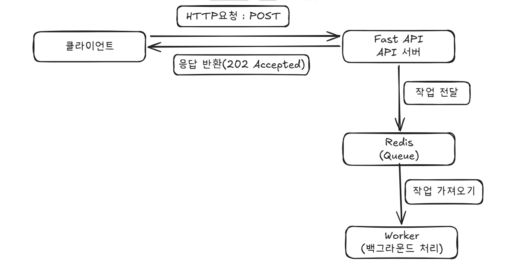

# [9일차] FastAPI와 Redis를 활용한 비동기 아키텍처 설계

> **학습 목표**
> 서버 블로킹 문제를 해결하기 위해 이벤트 기반 아키텍처(EDA)의 개념을 정립하고, FastAPI와 Redis를 활용한 비동기 작업 처리 구조를 설계한다.

---

## 1. 개요 및 배경

* **동기 처리의 한계**
  * 동기식 구조에서는 클라이언트 요청에 대해 서버가 작업을 완전히 마친 후 응답을 반환합니다.
  * 대용량 트래픽이나 지연 시간이 긴 작업(무거운 연산, 외부 API 호출 등)이 발생할 경우 서버 블로킹 및 응답 지연 현상이 발생합니다.

* **비동기 아키텍처(EDA) 도입**
  * 요청 접수와 실제 비즈니스 로직 처리를 분리하여, 클라이언트에게는 즉각적인 응답을 반환하고 무거운 작업은 백그라운드에서 비동기로 처리하는 구조를 설계합니다.

---

## 2. 시스템 구성 요소

* **FastAPI (API 서버 / Producer)**
  * 클라이언트의 HTTP 요청(`POST`)을 가장 먼저 수신합니다.
  * 무거운 작업을 직접 처리하지 않고 메시지 브로커로 전달한 뒤, 즉시 응답(`202 Accepted`)을 반환합니다.
* **Redis (Queue)**
  * 클라이언트의 요청 작업을 안전하게 적재하고 관리하는 대기열 역할을 수행합니다.
* **Worker (백그라운드 처리 / Consumer)**
  * 큐에 적재된 작업을 백그라운드에서 순차적으로 가져와 실제로 처리하는 독립된 실행 단위입니다.

---

## 3. 시스템 아키텍처 도식화

> 설계한 아키텍처 흐름도 (`클라이언트 ➔ FastAPI ➔ Redis ➔ Worker`)



---

## 4. 구현 예시 (아키텍처 흐름 연계)

앞서 설계한 아키텍처 도식화의 흐름이 실제 코드에서 어떻게 매칭되는지 확인합니다.

### ① [클라이언트 ➔ FastAPI] HTTP 요청 수신 및 즉시 응답
클라이언트가 `POST` 요청을 보내면, FastAPI 서버는 작업을 즉시 완료하는 것이 아니라 Redis(Queue)에 작업을 전달하고 곧바로 `202 Accepted` 응답을 반환합니다.

```python
from fastapi import APIRouter, status

router = APIRouter()


@router.post("/jobs", status_code=status.HTTP_202_ACCEPTED)
async def create_job(data: dict):
  # [아키텍처 도식화] '작업 전달' 단계에 해당
  # TODO: Redis 큐에 작업을 비동기로 전달하는 로직 (Celery 등 활용)

  return {
      "status": "accepted",
      "message": "작업이 접수되었습니다. (202 Accepted)",
  }

### ② [Redis ➔ Worker] 백그라운드 작업 처리
Redis 큐에 쌓인 작업은 독립된 Worker(백그라운드 처리)가 가져와서 순차적으로 비동기 실행합니다.

# [아키텍처 도식화] '작업 가져오기' 및 'Worker(백그라운드 처리)' 단계에 해당
def process_background_task(data: dict):
  # 시간이 소요되는 무거운 비즈니스 로직을 백그라운드에서 안전하게 처리
  pass